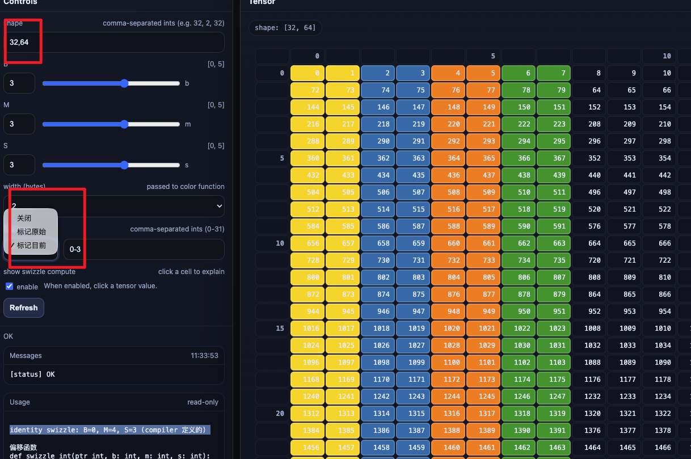
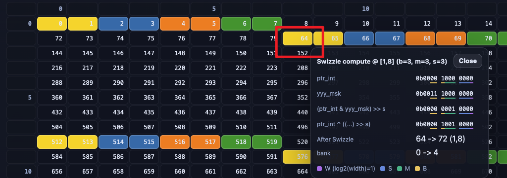
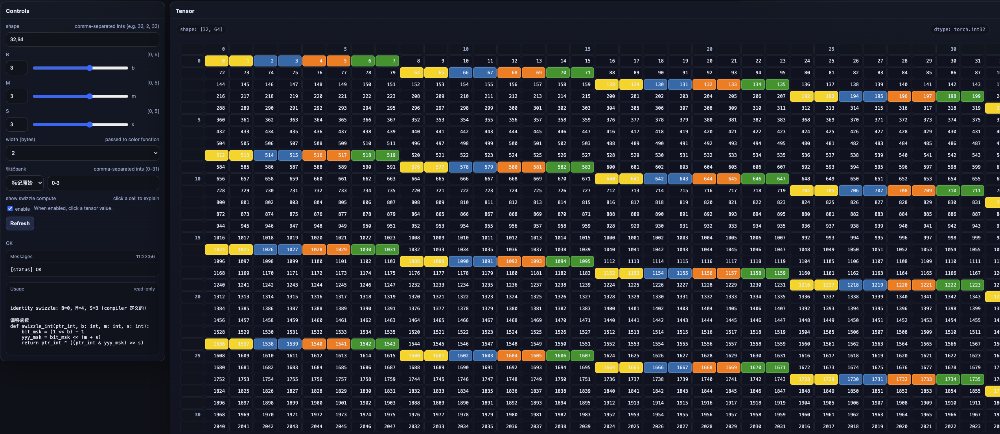

## SwizzleVis

[English](README.md) | [中文](README_cn.md)

一个单文件的 HTML Tensor / Swizzle 可视化小工具（Python `http.server` 后端）。启动后在浏览器里交互式查看张量布局、索引映射与（可选）bank 高亮。

### 快速开始

```bash
pip install -r requirements.txt
python swizzle_vis.py
```

然后打开 `http://localhost:8008`（默认监听 `0.0.0.0:8008`）。

### 可选环境变量

- **`TENSOR_VIZ_HOST`**: 监听地址，默认 `0.0.0.0`
- **`TENSOR_VIZ_PORT`**: 端口号，默认 `8008`
- **`TENSOR_VIZ_LOG`**: 设为 `1` 打开请求日志（默认静默）

### 截图

#### `assets/show.png`



#### `assets/sw_cal_block.png`



#### `assets/m8n8.png`


